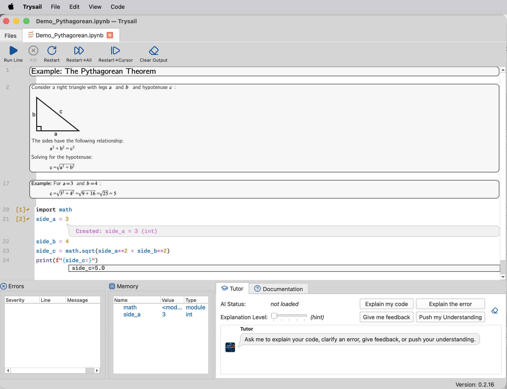
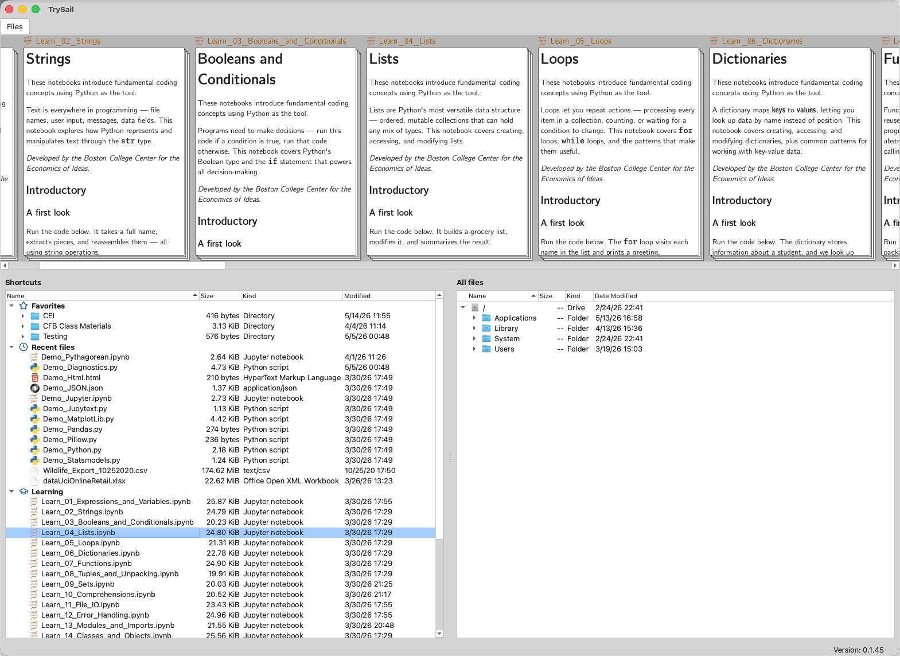
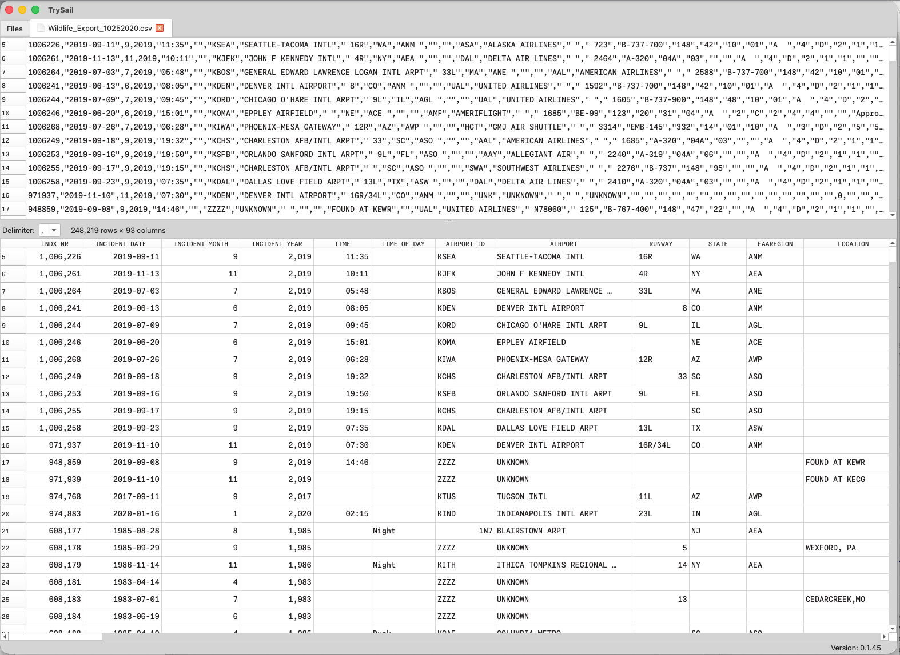
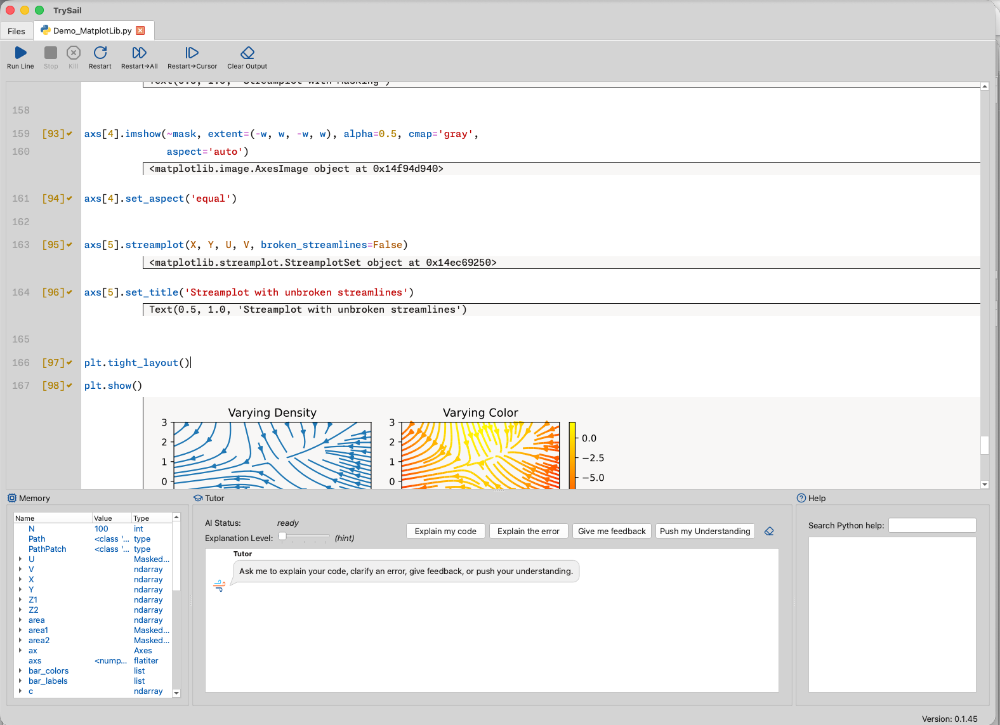
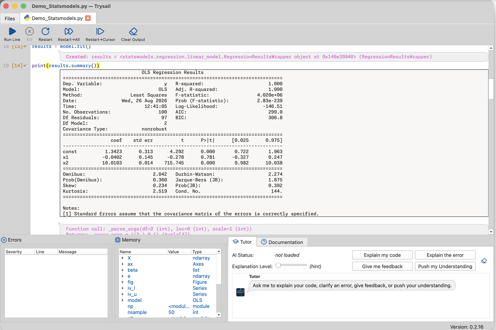
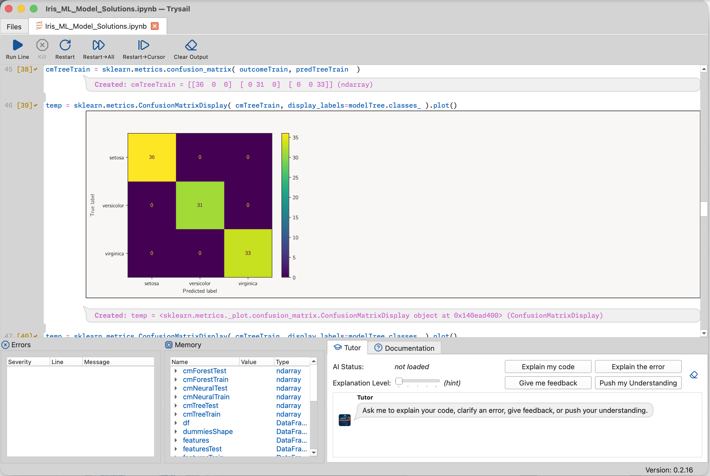

  

<h1 align="center">Trysail</h1>

  <strong>A code editor for Python learners.</strong> 
  <em>"Hello, World!" in under a minute, using only what beginners already know except code.</em>

  
  
  
  

  <em>Developed by the <a href="https://www.bc.edu/bc-web/schools/carroll-school/sites/center-for-the-economics-of-ideas.html">Center for the Economics of Ideas</a><a href="#about-the-center">†</a> at the Boston College Carroll School of Management.</em>

  

---

## Download the latest release

### Trysail

The complete Python code editor.

Mac: https://github.com/ransbotham3/MainsailPilots/releases/download/v0.2.15/Trysail.dmg

Windows: https://github.com/ransbotham3/MainsailPilots/releases/download/v0.2.15/Trysail.exe

### Sextant

A standalone file previewer (subset of Trysail) without Python

Mac: https://github.com/ransbotham3/MainsailPilots/releases/download/v0.2.15/Sextant.dmg

Windows: https://github.com/ransbotham3/MainsailPilots/releases/download/v0.2.15/Sextant.exe

---

## Contents

- [Why Trysail exists](#why-trysail-exists)
    - [Cyclic dependencies in learning](#cyclic-dependencies-in-learning)
    - [The day-one trap](#the-day-one-trap)
- [Trysail's answer](#trysails-answer)
    - [Pilot results](#pilot-results)
    - [How Trysail compares](#how-trysail-compares)
- [Getting Started](#getting-started)
    - [Install](#install)
    - [First five minutes](#first-five-minutes)
- [Key features](#key-features)
    - [Tour: what's inside](#tour-whats-inside)
    - [Packages included](#packages-included)
- [Feedback](#feedback)
- [Full feature list](#full-feature-list)

## Why Trysail exists

### Cyclic dependencies in learning

Some skills are cyclic; you need A to learn B, and B to learn A.

- **Language:** reading needs vocabulary; vocabulary grows through reading.
- **Biking:** balance needs motion; motion needs balance.

Without an outside push, beginners can't break in. Coding typically fits that cyclic pattern. Beginners need tools (Python, pip, terminal, IDE) to learn coding, and they need coding to learn the tools.

### The day-one trap

Before line 1 of Python, beginners typically must:

- **Download Python**, answering setup prompts they can't evaluate.
- **Use a terminal**, pasting commands on faith.
- **Install certificates**, without knowing what they are or why.
- **Configure an IDE**, before they know Python is the language and the IDE is the tool.
- **Install packages with `pip`**, without knowing what a package is.

Experienced developers gloss over these with "just run this." Beginners experience them as unintelligible magic, and learn that coding starts with doing things they don't understand.

## Trysail's answer

Break the cycle. Give beginners a positive coding experience first, building only on what they already know.

- **Mac & Windows app.** Standalone, no Python install, no package manager (pip/uv/conda), no terminal.
- **Runs Python line by line.** Inline output and a live memory view.
- **25+ packages built in**, including pandas, numpy, scikit-learn, statsmodels, matplotlib, seaborn, and plotly.
- **Embedded LLM tutor (DPO-tuned).** Guides learning; doesn't write the code for the user.
- **Uses `.ipynb` and `.py`.** Fits the file formats users will use later.
- **LaTeX math, rich markdown, data previewer, slide mode** built in.

### Pilot results

An introductory coding course at Boston College (successfully!) piloted Trysail in Spring 2026. The original plan was to transition off Trysail mid-semester, but positive student experiences deferred the transition until the end of the semester.

### How Trysail compares

|                                | Jupyter / Anaconda      | Replit / Colab        | **Trysail**         |
| ------------------------------ | ----------------------- | --------------------- | ------------------- |
| Local install footprint        | Multi-GB                | None (cloud)          | **Single download** |
| How to run                     | Start servers, browsers | Browser to URL, login | **Double click**    |
| Internet required to use       | No                      | Yes                   | **No**              |
| Terminal or package manager    | Often                   | No                    | **No**              |
| Output between every line      | Cell-based              | Cell-based            | **Yes**             |
| Always-visible memory view     | No (magics only)        | Limited               | **Yes**             |
| Embedded learning tutor        | No                      | Some                  | **Yes (DPO-tuned)** |
| Account / sign-in              | No                      | Yes                   | **No**              |

## Getting Started

### Install

*(Binaries are signed and notarized.)*

#### macOS

1. [Download the `.dmg`](https://github.com/ransbotham3/MainsailPilots/releases/download/v0.2.15/Trysail.dmg) and open it.
2. Drag **Trysail** into your `Applications` folder.
3. Double-click **Trysail** to launch. 

#### Windows

1. [Download `Trysail.exe`](https://github.com/ransbotham3/MainsailPilots/releases/download/v0.2.15/Trysail.exe).
2. Double-click to run.

### First five minutes

1. Launch Trysail.
2. On the **Files** tab, open one of the built-in learning notebooks (e.g. `Learn_01_Expressions_and_Variables.ipynb`).
3. Click anywhere on a line of code and press **Run Line**.
4. Watch the output appear *between* lines, and watch the **Memory** panel on the lower-left update.
5. In the **Tutor** panel, click **Explain my code** to see the embedded LLM walk through what just happened.

That's the loop: read, run, see state, ask. No setup, no terminal, no pip/uv/conda.

## Key features

### Tour: what's inside

#### The main editor

Inline output and a live memory view, with the LLM tutor and Python help side-by-side:

  

#### Built-in learning content

Learning notebooks (Strings, Booleans & Conditionals, Lists, Loops, Dictionaries, Functions, …) plus favorites and recent files:

  

#### Data previewer

CSVs render as both raw text and a navigable table, with no copy-paste into Excel:

  

#### Analytics and ML, output inline

Plots, regression results, and ML model output all render between the lines that produced them:

  
  

  

### Packages included

`numpy`, `scipy`, `pandas`, `matplotlib`, `seaborn`, `plotnine`, `plotly`, `scikit-learn`, `statsmodels`, `nltk`, `beautifulsoup4`, `requests`, `pillow`, `psutil`, `glpk`.

If a package your class needs isn't on this list, please [open an issue](https://github.com/ransbotham3/MainsailPilots/issues). The goal is to cover the standard intro-analytics and intro-ML stack out of the box.

## Feedback

### For instructors

If you're teaching an introductory coding, analytics, or ML course and want to evaluate TrySail for your class, grab the [current release](#download-the-latest-release) at the top of this page. Let us know you are using it. We'd love to hear about your experiences.

### Issues and bugs

If something breaks, confuses a student, or doesn't fit your course, [open an issue](https://github.com/ransbotham3/MainsailPilots/issues). Feedback shapes the next release.

---

## Full feature list

<strong>Click to expand</strong>

### File support

- Opens `.ipynb` (Jupyter) or `.py` (including Jupytext-encoded).
- Renders existing notebook output on open.
- Markdown / HTML / JSON / plain-text editors.

### Editing

- Standard text-editor key navigation, find/replace, save / save as, zoom.
- Syntax highlighting as you type.
- Light and dark modes with multiple color themes (Preferences).
- Pinned favorite files and a recent-files list.

### Running code

- **Run Line** runs the current line or the selected region.
- **Automatic "cells":** the editor figures out logical blocks (continuous markdown, indented code) so users do not have to learn Jupyter's cell mental model until they are ready.
- Code executes in a background thread; **Stop** for a graceful halt, **Kill** for stuck loops.
- Inline output appears below the line that produced it **without** insane `get_ipython().ast_node_interactivity = 'all'` confusion.
- The Memory pane shows variables as code creates and changes them.

### Markdown

- Each line is either code or markdown (toggle via Edit → Line Type).
- Markdown renders immediately below the line; raw-edit via Markdown Edit.
- LaTeX math support, enriched markdown, inline svg/jpg/png.

### Data preview

- Preview delimited files (csv, tab, etc.) or Excel (xlsx) documents.
- Lightning fast.
- Beginners can play with delimiters to see differences and learn.

### Quick look

- On MacOS, Trysail provides Quick Look services in Finder to show Jupyter Notebooks and source code with highlighting.

### Other

- Slide mode, code tracing.
- Copy output, explanation show/hide.

### Sextant

If you only need to preview files (like Jupyter Notebooks, markdown, source code, etc.) then the Sextant app is a subset of Trysail without Python.

<strong>Roadmap notes</strong>

After the project settles, the source code will be made openly available.

---

<strong>† About the Center for the Economics of Ideas.</strong> The Center for the Economics of Ideas is a research center at Boston College's Carroll School of Management, launched in 2023. Its founding director is Paul Romer, the Seidner University Professor and 2018 Nobel laureate in economics recognized for demonstrating how economic forces govern firms' willingness to produce new ideas and innovations; at BC, Romer teaches "Digital Self Defense With Python" and focuses on digital security, authenticity, and integrity. He is joined by Sam Ransbotham, Professor of Business Analytics and the Mastrocola Dean's Faculty Fellow, whose work centers on machine learning and AI in business. The Center's three focus areas (communicating ideas, digital authenticity, and the promotion of open collaboration) together aim to develop tools that combine prose with code, certify the integrity of digital files for authors and publishers, and safeguard the economics of ideas in the digital age.
